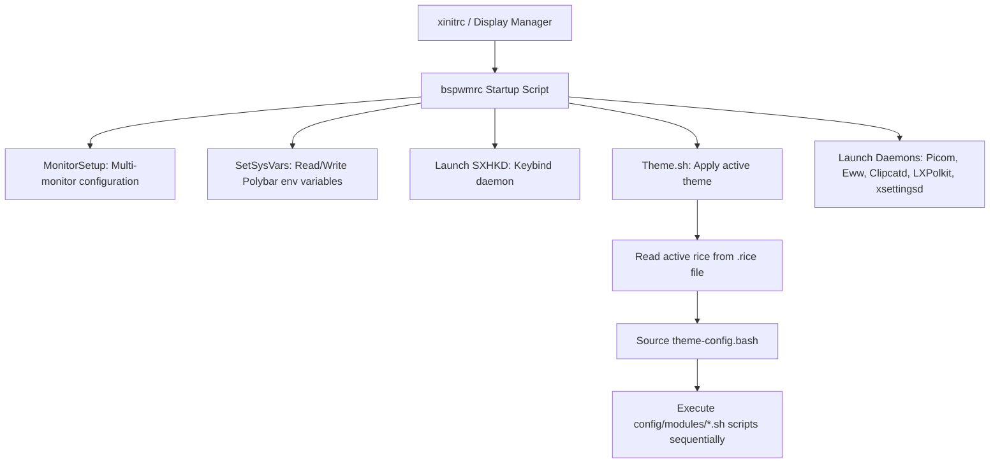

# 👻 gh0stzk's BSPWM Dotfiles: Architectural & Functional Overview

Welcome to the comprehensive overview of **gh0stzk's BSPWM Dotfiles** repository—a premium, lightweight, and highly customized window manager environment built for **Arch Linux**. 

This document serves as a complete technical guide to the architecture, core modules, theme mechanics, and directory structure of this environment.

---

## 🚀 1. Design Philosophy & Core Features

Unlike traditional heavy desktop environments (DEs) or bloated pre-configured distributions, this setup prioritizes **ultra-lightweight efficiency** combined with **premium, state-of-the-art visual design**.

### 🌟 Key Pillars
*   **Minimal Resource Footprint**: Starts under **500 MB of RAM** usage, highlighting a strict minimalist approach to memory management.
*   **On-the-Fly Theme Switching**: Swap between 18 unique visual styles instantly with zero desktop reloads. Services (BSPWM, SXHKD, Picom, Dunst) keep running smoothly.
*   **Visual Consistency**: A single theme change propagates instantly across the window manager, terminals (Alacritty, Kitty, st), system bars (Polybar), desktop widgets (Eww), notification daemons (Dunst), launchers (Rofi), editor configurations (Geany), file managers (Yazi), and GTK visual layers.
*   **Highly Extensible & Modular**: Theme-specific settings are written in clean, declarative Bash variables, and specialized scripts control distinct system modules.
*   **Default Display Target**: Hand-tuned for **1600x900 resolution** at **96 DPI** on single/multi-monitor setups.

---

## 🎨 2. The 18 Rices (Themes)

The repository provides **18 curated themes** (often referred to as "rices"), each bringing unique styling, fonts, HSL-tailored color palettes, and customized desktop panels:

| Theme Name | Description & Aesthetic |
| :--- | :--- |
| **Aline** | Based on the elegant, soft **Rose Pine Dawn** color palette; clean and relaxing. |
| **Andrea** | A darker, sophisticated workspace with contrast-focused aesthetics. |
| **Brenda** | Modern, vibrant neon-accented dark theme. |
| **Cristina** | Sleek, dark minimalist look optimized for high-productivity coding environments. |
| **Cynthia** | Soft pastel colors emphasizing readability and calming pastel gradients. |
| **Daniela** | Deep, dark-hued theme with carefully contrasted interactive elements. |
| **Emilia** | Beautifully composed layout featuring high-contrast text and a cozy color palette. |
| **h4ck3r** | Terminal-centric, high-visibility green-and-black cyber aesthetic. |
| **Isabel** | Earthy tones combined with subtle gradients and cozy layout aesthetics. |
| **Jan** | Rich dark mode utilizing warm highlights and subtle gray backgrounds. |
| **Karla** | A crisp, vibrant theme designed with high-contrast workspace visuals. |
| **Marisol** | Soft warm-toned theme utilizing light backgrounds for clean daylight usability. |
| **Melissa** | Sophisticated blue and deep purple gradients with sharp UI elements. |
| **Pamela** | Lavender-infused layout that feels modern, cozy, and distinct. |
| **Silvia** | Slate-gray industrial look, built for distraction-free software development. |
| **Varinka** | Earthy, green-infused forest-like palette offering natural tones. |
| **Yael** | Deep twilight-inspired dark layout with rich indigo accents. |
| **z0mbi3** | gh0stzk's flagship theme: dark, high-contrast, bold, and fully loaded. |

---

## 🛠️ 3. System Architecture & Startup Flow

The ecosystem starts with standard X11 initialization and progresses through a highly structured modular startup sequence managed by BSPWM:



### Startup Sequence (`bspwmrc`)
1.  **Environment Variables**: Configures PATH, registers `bspwm` as the current XDG desktop, and sets Java non-parenting fixes.
2.  **`MonitorSetup`**: Autodetects up to 4 monitors and builds appropriate workspace configurations.
3.  **`ExternalRules`**: Directs floating, workspace-specific, or scratchpad behaviors for newly created windows.
4.  **`SetSysVars`**: Writes system interface names (network cards, batteries, thermal zones) to a dynamic configuration file (`system.ini`) for Polybar to access on startup.
5.  **`sxhkd`**: Begins keyboard shortcut capture using keybind definitions inside `config/sxhkdrc`.
6.  **`Theme.sh`**: The orchestrator of dynamic theming.
7.  **Service Daemons**: Launches `picom` (animations and compositor), `xsettingsd` (GTK parameters), `eww` (widgets), `clipcatd` (clipboard logs), and `lxpolkit` (authentication).

---

## 📂 4. Project Directory Structure

```
.
├── config/                 # Sub-configurations (placed into ~/.config/)
│   ├── alacritty/          # Custom-themed Alacritty terminal configurations
│   ├── bspwm/              # Main Window Manager folder
│   │   ├── bin/            # System helper & UI management scripts (31 files)
│   │   ├── config/         # System config, modules, and Rofi styles
│   │   │   └── modules/    # Individual theme module scripts (00-14.sh)
│   │   ├── eww/            # Custom Eww widgets (cheatsheet, player, profile)
│   │   └── rices/          # Individual configs/wallpapers for the 18 themes
│   ├── kitty/              # Custom-themed Kitty terminal configurations
│   ├── nvim/               # Highly optimized Neovim development workspace
│   ├── yazi/               # Custom file manager configuration
│   └── zsh/                # Clean, custom Zsh shell modules (native)
├── home/                   # Dotfiles going straight to the home folder (~/)
│   ├── .gtkrc-2.0          # Fallback legacy GTK-2 configuration
│   ├── .icons/             # System custom cursors and icon folders
│   └── .zshrc              # Core, native-optimized Zsh profile
├── misc/                   # GRUB, lockscreen assets, and auxiliary wallpapers
├── RiceInstaller           # Automated Arch Linux dependency installer script
└── SUMMARY.md              # Project structure and technical design (This file)
```

---

## ⚡ 5. Dynamic Theme Mechanics (`Theme.sh` & Modules)

The key to gh0stzk's fast on-the-fly thematic shifting lies in **modular scripting**. When a theme is changed:
1.  The name of the chosen rice is written to `~/.config/bspwm/.rice`.
2.  `Theme.sh` reads this file and sources `theme-config.bash` from the corresponding rice directory. This populates dozens of env variables containing hex colors (`bg`, `fg`, `red`, etc.), border parameters, font faces, and paths.
3.  `Theme.sh` loops through and executes all scripts in `~/.config/bspwm/config/modules/` sequentially:

*   **`00-processes.sh`**: Safely kills/reloads Dunst, Clipcat, Eww, or specialized processes to release file handles.
*   **`01-picom.sh`**: Generates a dynamic Picom configuration mapping borders, opacity, fading, and animation properties per theme.
*   **`02-bspwm.sh`**: Interacts with the running BSPWM instance via `bspc config` commands to modify gaps, active/inactive border colors, and window offsets on the fly.
*   **`03-alacritty.sh` / `14-kitty.sh`**: Re-writes terminal color configurations inline using `sed` or target standard templates, causing terminal windows to adapt colors instantly without closing.
*   **`05-gtk.sh`**: Rewrites `xsettingsd` and standard GTK properties so that visual windows (e.g., Thunar, Geany) dynamically update icons, cursors, and layout aesthetics.
*   **`06-wallpaper.sh`**: Triggers the designated **Wallpaper Engine** (Static, Random, Animated, Slideshow, or Custom Directory).
*   **`07-bar.sh`**: Launches the correct instance of **Polybar** utilizing the theme's own `Bar.bash`, matching its custom visual compartments.
*   **`08-dunst.sh`**: Rebuilds Dunst configuration files with new geometry margins, alert colors, font mappings, and custom notifications.
*   **`09-rofi.sh` / `10-jgmenu.sh` / `11-eww.sh`**: Updates theme configurations for launchers, context menus, and widgets.

---

## 🎨 6. Advanced Desktop Utilities

*   **RiceEditor**: A powerful built-in GUI application (`config/bspwm/bin/RiceEditor`) that lets users customize shadows, borders, animations, and font settings interactively without manual file modification.
*   **Eww Desktop Widgets**: Includes beautiful interactive modules:
    *   *Profile Panel*: System info, user image, and uptime metrics.
    *   *Music Player*: Dynamic album art, progress bar, play/pause controls (integrates with playerctl).
    *   *Cheat Sheet*: Interactive shortcut guide (toggled with `Alt + F1`).
*   **Rofi Applets**: Beautiful, pre-configured launcher panels built for core system administration (NetworkManager, Bluetooth, Power Menu, Clipboard manager, and Screenshot tools).
*   **Wallpaper Engines**: Supports five robust options configured per-theme:
    1.  *Theme*: Loads a random wallpaper from the theme's own `walls/` folder.
    2.  *CustomDir*: Pulls random pictures from a user-specified folder.
    3.  *Default*: Targets a single high-quality static wallpaper image.
    4.  *Animated*: Plays `.mp4`, `.mkv`, or `.gif` video files as a dynamic live background.
    5.  *Slideshow*: Rotates a new theme wallpaper automatically every 15 minutes.
*   **BSPWM Scratchpad**: Configured floating window that pulls up a temporary terminal or note-taking container using a quick keyboard combination without cluttering active workspaces.

---

## 💻 7. Pre-Configured Development Environments

### Neovim Setup (`config/nvim`)
A state-of-the-art terminal coding experience combining lightning-fast startup with IDE-level features:
*   **AST Parsers**: Syntax trees powered by **Treesitter**.
*   **IntelliSense**: Completions via **blink.nvim** and formatting through **conform.nvim**.
*   **Interactive Search**: Unified picker and file explorer using **snacks.nvim**.
*   **Buffer Tabs & UI**: Styled tabs using **barbar.nvim**, customized bottom bar with **lualine.nvim**, and indent guides.

### Optimized Zsh (`config/zsh` & `home/.zshrc`)
Provides a rapid shell environment optimized entirely natively (avoiding heavy overhead frameworks like Oh-My-Zsh):
*   Fast auto-completions, syntax highlighting, and history substring lookups.
*   **`fzf-tab` Integration**: Displays interactive menu previews of directories (`ls`), processes (`kill`), packages (`pacman`), and systemd units (`systemctl`) directly inside the autocomplete dialog!

---

## 🔌 8. Installation Engine (`RiceInstaller`)

The installer script (`RiceInstaller`) provides a safe, non-destructive gateway to deploy the dotfiles on a pre-existing Arch Linux configuration:
1.  **Checks environment validity**: Ensures execution from `$HOME` as a regular non-root user.
2.  **Adds Custom Repositories**:
    *   Adds `gh0stzk-dotfiles` custom repo to `pacman.conf` to serve pre-compiled packages.
    *   Integrates the **Chaotic-AUR** repo for bleeding-edge pre-built packages.
3.  **Dependency Handling**: Resolves and installs 75+ core utilities, terminal binaries, GTK styles, libraries, and fonts.
4.  **Automatic Backup**: Gracefully backs up any existing system dotfiles (e.g., `.config/bspwm`, `.config/polybar`) before copying the new files to avoid any data loss.
5.  **Service Setup**: Initializes the Music Player Daemon (`mpd`) service and sets the default terminal shell to Zsh.
